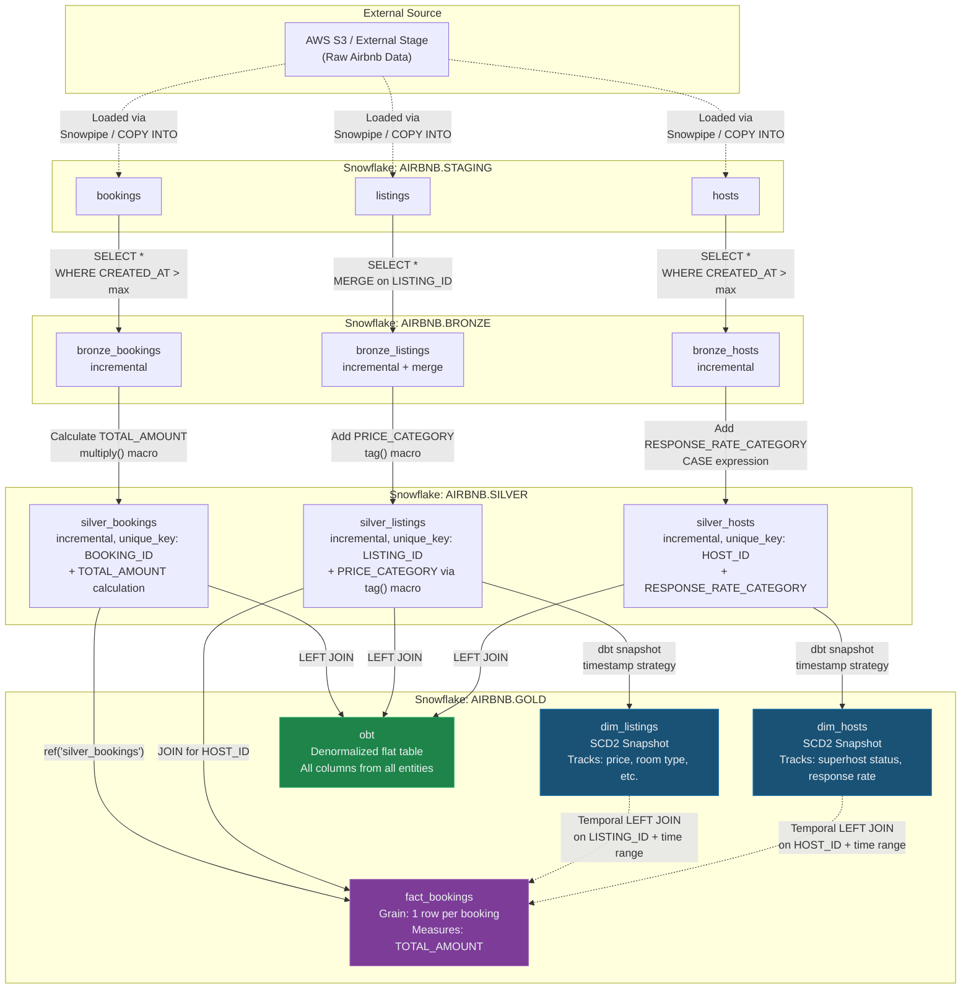
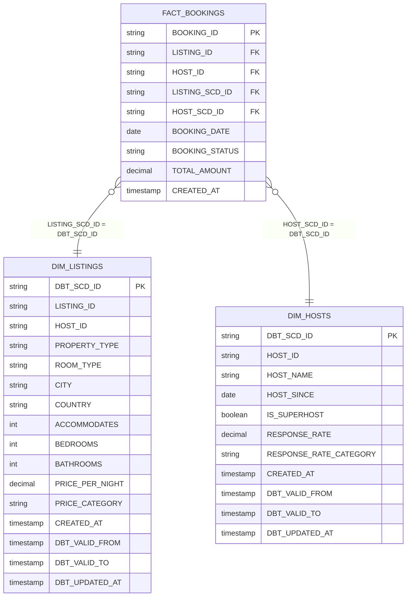
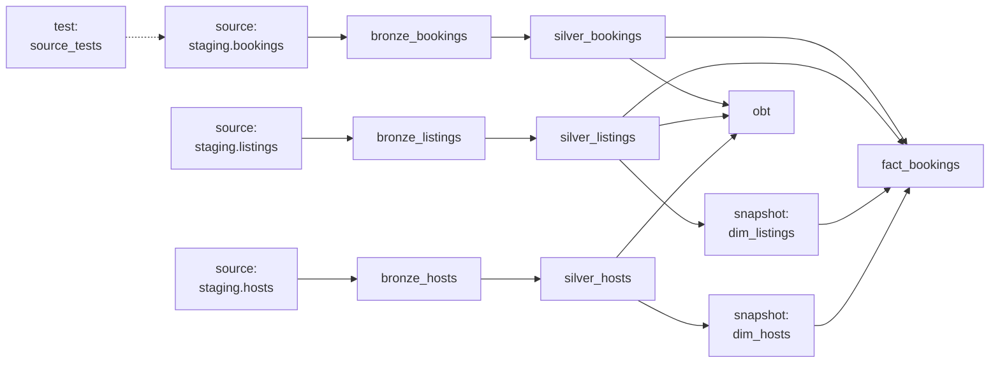

# Airbnb dbt + Snowflake: Complete Project Walkthrough

---

## Table of Contents

1. [Technology Stack](#1-technology-stack)
2. [Project Structure](#2-project-structure)
3. [Configuration Deep Dive](#3-configuration-deep-dive)
4. [Data Flow — End to End](#4-data-flow--end-to-end)
5. [Source Layer](#5-source-layer)
6. [Bronze Layer — Raw Ingestion](#6-bronze-layer--raw-ingestion)
7. [Silver Layer — Business Transformations](#7-silver-layer--business-transformations)
8. [Gold Layer — Star Schema + Analytics](#8-gold-layer--star-schema--analytics)
9. [Snapshots — Slowly Changing Dimensions](#9-snapshots--slowly-changing-dimensions)
10. [Custom Macros](#10-custom-macros)
11. [Data Testing](#11-data-testing)
12. [Running the Project](#12-running-the-project)
13. [Snowflake Schema Map](#13-snowflake-schema-map)

---

## 1. Technology Stack

| Technology | Version | Purpose |
|------------|---------|---------|
| **dbt-core** | 1.11.7 | Data transformation framework — SQL-based modeling with dependency management, testing, documentation |
| **dbt-snowflake** | 1.11.3 | Snowflake adapter for dbt — translates dbt operations into Snowflake SQL |
| **Snowflake** | Cloud | Cloud data warehouse — stores all raw and transformed data |
| **Python** | ≥ 3.10 | Runtime for dbt |
| **uv** | — | Python package manager — manages virtual environment and dependencies (`.venv/`) |

### Why These Technologies?

- **dbt** handles the "T" in ELT — it doesn't extract or load data, it transforms data that's already in Snowflake using SQL + Jinja templating
- **Snowflake** provides scalable compute (warehouses) and storage separation, columnar storage for analytics, and native support for SCD2 via MERGE
- **uv** is a fast, modern Python package manager that replaces pip + virtualenv (configured in `pyproject.toml`)

### Project Dependencies

```toml
# pyproject.toml
[project]
name = "aws-dbt-snowflake"
version = "0.1.0"
requires-python = ">=3.10"
dependencies = [
    "dbt-core>=1.11.7",
    "dbt-snowflake>=1.11.3",
]
```

---

## 2. Project Structure

```
e:\AWS_DBT_snowflake\
├── .venv/                          # Python virtual environment (uv-managed)
├── pyproject.toml                  # Python project config & dependencies
├── main.py                         # Entry point (placeholder)
│
└── aws_dbt_snowflake_project/      # ◄ dbt project root
    ├── dbt_project.yml             # Project-level configuration
    ├── profiles.yml                # Snowflake connection credentials
    │
    ├── models/
    │   ├── sources/
    │   │   └── sources.yml         # Source table definitions
    │   ├── bronze/
    │   │   ├── bronze_bookings.sql # Raw bookings ingestion
    │   │   ├── bronze_listings.sql # Raw listings ingestion
    │   │   └── bronze_hosts.sql    # Raw hosts ingestion
    │   ├── silver/
    │   │   ├── silver_bookings.sql # Cleaned bookings with calculated fields
    │   │   ├── silver_listings.sql # Cleaned listings with price categories
    │   │   └── silver_hosts.sql    # Cleaned hosts with response categories
    │   └── gold/
    │       ├── obt.sql             # One Big Table (denormalized analytics)
    │       └── fact_bookings.sql   # Star schema fact table
    │
    ├── snapshots/
    │   ├── dim_listings.yml        # SCD2 snapshot for listings dimension
    │   └── dim_hosts.yml           # SCD2 snapshot for hosts dimension
    │
    ├── macros/
    │   ├── generate_schema_name.sql # Custom schema routing
    │   ├── multiply.sql             # Arithmetic helper
    │   ├── tag.sql                  # Price categorization
    │   └── trimmer.sql              # String formatting
    │
    ├── tests/
    │   └── source_tests.sql         # Data quality validation
    │
    ├── seeds/                       # CSV seed files (empty)
    ├── analyses/                    # Ad-hoc analysis queries (empty)
    └── target/                      # Compiled SQL output (git-ignored)
```

---

## 3. Configuration Deep Dive

### 3.1 Snowflake Connection — `profiles.yml`

```yaml
aws_dbt_snowflake_project:
  outputs:
    dev:
      type: snowflake
      account: ZNYXFSI-AN36035
      user: AbhyanBansal
      password: ********
      role: ACCOUNTADMIN
      database: AIRBNB
      schema: dbt_schema           # Default schema (overridden by models)
      warehouse: COMPUTE_WH
      threads: 1                   # Sequential model execution
  target: dev                      # Active target environment
```

| Parameter | Value | Explanation |
|-----------|-------|-------------|
| `type` | `snowflake` | Tells dbt to use the Snowflake adapter |
| `account` | `ZNYXFSI-AN36035` | Snowflake account identifier (org-account format) |
| `role` | `ACCOUNTADMIN` | Snowflake role with full privileges |
| `database` | `AIRBNB` | All tables are created in this database |
| `schema` | `dbt_schema` | Default schema — used only when no custom schema is specified |
| `warehouse` | `COMPUTE_WH` | Snowflake virtual warehouse for running queries |
| `threads` | `1` | Number of models dbt builds in parallel (1 = sequential) |
| `target` | `dev` | Which output config to use (supports multiple environments) |

### 3.2 Project Configuration — `dbt_project.yml`

```yaml
name: 'aws_dbt_snowflake_project'
version: '1.0.0'
profile: 'aws_dbt_snowflake_project'   # Links to profiles.yml

# Directory mappings
model-paths: ["models"]
analysis-paths: ["analyses"]
test-paths: ["tests"]
seed-paths: ["seeds"]
macro-paths: ["macros"]
snapshot-paths: ["snapshots"]

clean-targets:
  - "target"           # Compiled SQL output
  - "dbt_packages"     # Installed dbt packages

# Model materialization & schema configuration
models:
  aws_dbt_snowflake_project:
    bronze:
      +materialized: table        # Full table rebuild each run
      +schema: bronze             # → AIRBNB.BRONZE
    silver:
      +materialized: table        # Full table rebuild each run
      +schema: silver             # → AIRBNB.SILVER
    gold:
      +materialized: table        # Full table rebuild each run
      +schema: gold               # → AIRBNB.GOLD
```

**Key configuration decisions**:

- **`+materialized: table`** at the directory level — sets the default for all models in that directory. Individual models can override this (e.g., silver models override to `incremental`)
- **`+schema`** — routes models to specific Snowflake schemas. This works with the custom `generate_schema_name` macro (see Section 10)
- The `+` prefix means "apply to this directory AND all subdirectories"

### 3.3 Custom Schema Routing — `generate_schema_name` Macro

By default, dbt concatenates `<target_schema>_<custom_schema>` (e.g., `dbt_schema_bronze`). This project overrides that behavior:

```sql

    
    
        {{ default_schema }}          {# → dbt_schema #}
    
        {{ custom_schema_name | trim }} {# → bronze / silver / gold (exact name) #}
    

```

**Effect**: When `+schema: bronze` is set, models go to `AIRBNB.BRONZE` (not `AIRBNB.DBT_SCHEMA_BRONZE`). This gives clean, production-ready schema names.

---

## 4. Data Flow — End to End

### 4.1 Complete Architecture Diagram



### 4.2 Star Schema ERD



### 4.3 dbt DAG (Build Order)



dbt automatically resolves this DAG from `{{ ref() }}` and `{{ source() }}` calls. It ensures each model builds only after its dependencies are ready.

---

## 5. Source Layer

**File**: [sources.yml](file:///e:/AWS_DBT_snowflake/aws_dbt_snowflake_project/models/sources/sources.yml)

```yaml
sources:
  - name: staging
    database: airbnb
    schema: staging
    tables:
      - name: listings
      - name: bookings
      - name: hosts
```

This tells dbt that raw data lives in `AIRBNB.STAGING` with three tables. Models reference these via `{{ source('staging', 'bookings') }}` instead of hardcoding table names.

**Why use sources?**
- dbt tracks lineage from raw data through all transformations
- Source freshness checks can validate data pipeline health
- Centralized definition — if the schema changes, update one file

---

## 6. Bronze Layer — Raw Ingestion

The Bronze layer copies raw data from staging into the `AIRBNB.BRONZE` schema. Its job is purely **ingestion** — no business logic, no transformations.

### 6.1 Incremental Loading Pattern

All three Bronze models use dbt's **incremental materialization** to avoid reprocessing the entire source table on every run:

```sql
-- bronze_bookings.sql
{{ config(materialized='incremental') }}

SELECT * FROM {{ source('staging', 'bookings') }}

    WHERE CREATED_AT > (SELECT COALESCE(MAX(CREATED_AT), '1970-01-01') FROM {{ this }})

```

**How it works**:

| Run Type | Behavior |
|----------|----------|
| **First run** (table doesn't exist) | `is_incremental()` = false → loads ALL rows (full SELECT) |
| **Subsequent runs** (table exists) | `is_incremental()` = true → loads only rows WHERE `CREATED_AT > max existing` |

The `COALESCE(..., '1970-01-01')` handles edge cases where the target table exists but is empty.

### 6.2 Bronze Listings — Merge Strategy

`bronze_listings` uses a different incremental approach:

```sql
{{ config(
    materialized='incremental',
    unique_key='LISTING_ID',
    incremental_strategy='merge'
) }}
```

| Config | Effect |
|--------|--------|
| `unique_key='LISTING_ID'` | Identifies rows by listing ID |
| `incremental_strategy='merge'` | Uses Snowflake MERGE (upsert) — updates existing rows, inserts new ones |

**Why merge for listings?** Listings can be updated (price changes, room type changes). A simple append would create duplicates. MERGE ensures one row per `LISTING_ID`, with the latest values.

---

## 7. Silver Layer — Business Transformations

The Silver layer applies **business logic and data enrichment**. Each model is `incremental` with a `unique_key` to ensure deduplication.

### 7.1 Silver Bookings

**File**: [silver_bookings.sql](file:///e:/AWS_DBT_snowflake/aws_dbt_snowflake_project/models/silver/silver_bookings.sql)

```sql
{{ config(materialized='incremental', unique_key='BOOKING_ID') }}

SELECT
    BOOKING_ID,
    LISTING_ID,
    BOOKING_DATE,
    {{ multiply('NIGHTS_BOOKED', 'BOOKING_AMOUNT', 2) }} + SERVICE_FEE + CLEANING_FEE AS TOTAL_AMOUNT,
    BOOKING_STATUS,
    CREATED_AT
FROM {{ ref('bronze_bookings') }}
```

**Transformation**: Calculates `TOTAL_AMOUNT` using the custom `multiply()` macro:
```
TOTAL_AMOUNT = ROUND(NIGHTS_BOOKED × BOOKING_AMOUNT, 2) + SERVICE_FEE + CLEANING_FEE
```

### 7.2 Silver Listings

**File**: [silver_listings.sql](file:///e:/AWS_DBT_snowflake/aws_dbt_snowflake_project/models/silver/silver_listings.sql)

```sql
{{ config(materialized='incremental', unique_key='LISTING_ID') }}

SELECT
    LISTING_ID, HOST_ID, PROPERTY_TYPE, ROOM_TYPE,
    CITY, COUNTRY, ACCOMMODATES, BEDROOMS, BATHROOMS,
    PRICE_PER_NIGHT,
    {{ tag('cast(price_per_night as integer)') }} AS PRICE_CATEGORY,
    CREATED_AT
FROM {{ ref('bronze_listings') }}
```

**Transformation**: Adds `PRICE_CATEGORY` using the custom `tag()` macro:
```
PRICE_PER_NIGHT < 100  → 'LOW'
PRICE_PER_NIGHT < 200  → 'MEDIUM'
PRICE_PER_NIGHT >= 200 → 'HIGH'
```

### 7.3 Silver Hosts

**File**: [silver_hosts.sql](file:///e:/AWS_DBT_snowflake/aws_dbt_snowflake_project/models/silver/silver_hosts.sql)

```sql
{{ config(materialized='incremental', unique_key='HOST_ID') }}

SELECT
    HOST_ID,
    REPLACE(HOST_NAME, ' ', '_') AS HOST_NAME,
    HOST_SINCE, IS_SUPERHOST, RESPONSE_RATE,
    CASE
        WHEN RESPONSE_RATE >= 95 THEN 'VERY GOOD'
        WHEN RESPONSE_RATE >= 80 THEN 'GOOD'
        WHEN RESPONSE_RATE >= 60 THEN 'FAIR'
        ELSE 'POOR'
    END AS RESPONSE_RATE_CATEGORY,
    CREATED_AT
FROM {{ ref('bronze_hosts') }}
```

**Transformations**:
- Replaces spaces in `HOST_NAME` with underscores
- Categorizes `RESPONSE_RATE` into `VERY GOOD / GOOD / FAIR / POOR`

---

## 8. Gold Layer — Star Schema + Analytics

The Gold layer serves two parallel purposes:

| Pattern | Table | Purpose | Consumers |
|---------|-------|---------|-----------|
| **Star Schema** | `fact_bookings` + `dim_listings` + `dim_hosts` | Structured analytical model | BI tools (Tableau, Power BI, Looker) |
| **OBT** | `obt` | Flat denormalized table | Ad-hoc queries, data science, notebooks |

### 8.1 Fact Table — `fact_bookings`

**File**: [fact_bookings.sql](file:///e:/AWS_DBT_snowflake/aws_dbt_snowflake_project/models/gold/fact_bookings.sql)

```sql
WITH bookings AS (
    SELECT
        b.BOOKING_ID,
        b.LISTING_ID,
        l.HOST_ID,
        b.BOOKING_DATE,
        b.BOOKING_STATUS,
        b.TOTAL_AMOUNT,
        b.CREATED_AT
    FROM {{ ref('silver_bookings') }} AS b
    LEFT JOIN {{ ref('silver_listings') }} AS l
        ON b.LISTING_ID = l.LISTING_ID
)

SELECT
    b.BOOKING_ID,
    b.LISTING_ID,
    b.HOST_ID,
    dl.DBT_SCD_ID AS LISTING_SCD_ID,
    dh.DBT_SCD_ID AS HOST_SCD_ID,
    b.BOOKING_DATE,
    b.BOOKING_STATUS,
    b.TOTAL_AMOUNT,
    b.CREATED_AT
FROM bookings AS b
LEFT JOIN {{ ref('dim_listings') }} AS dl
    ON b.LISTING_ID = dl.LISTING_ID
    AND b.CREATED_AT >= dl.DBT_VALID_FROM
    AND b.CREATED_AT < COALESCE(dl.DBT_VALID_TO, TO_TIMESTAMP_NTZ('9999-12-31'))
LEFT JOIN {{ ref('dim_hosts') }} AS dh
    ON b.HOST_ID = dh.HOST_ID
    AND b.CREATED_AT >= dh.DBT_VALID_FROM
    AND b.CREATED_AT < COALESCE(dh.DBT_VALID_TO, TO_TIMESTAMP_NTZ('9999-12-31'))
```

**Design breakdown**:

| Column | Type | Source | Purpose |
|--------|------|--------|---------|
| `BOOKING_ID` | Primary Key | silver_bookings | Unique booking identifier |
| `LISTING_ID` | Foreign Key | silver_bookings | Links to dim_listings (natural key) |
| `HOST_ID` | Foreign Key | silver_listings | Links to dim_hosts (natural key) |
| `LISTING_SCD_ID` | Foreign Key | dim_listings.DBT_SCD_ID | Links to exact historical version of listing |
| `HOST_SCD_ID` | Foreign Key | dim_hosts.DBT_SCD_ID | Links to exact historical version of host |
| `BOOKING_DATE` | Degenerate Dim | silver_bookings | When the booking was made |
| `BOOKING_STATUS` | Degenerate Dim | silver_bookings | confirmed / cancelled / pending |
| `TOTAL_AMOUNT` | Measure | silver_bookings | Revenue from this booking (SUM-able) |
| `CREATED_AT` | Metadata | silver_bookings | Record timestamp, used for temporal joins |

**CTE logic**: The CTE joins `silver_bookings` to `silver_listings` to get the `HOST_ID` (since bookings reference listings, and listings reference hosts — the booking doesn't directly store the host).

**Temporal join logic**: The LEFT JOINs to `dim_listings` and `dim_hosts` use **point-in-time** matching. A booking created on March 15, 2024 joins to the dimension version that was active on that date — not the current version. This is critical for accurate historical analysis.

### 8.2 One Big Table — `obt`

**File**: [obt.sql](file:///e:/AWS_DBT_snowflake/aws_dbt_snowflake_project/models/gold/obt.sql)

The OBT uses a **Jinja-driven dynamic JOIN pattern**:

```sql
{% set configs = [
    {
        "table": "AIRBNB.SILVER.SILVER_BOOKINGS",
        "columns": "SILVER_BOOKINGS.*",
        "alias": "SILVER_BOOKINGS"
    },
    {
        "table": "AIRBNB.SILVER.SILVER_LISTINGS",
        "columns": "SILVER_LISTINGS.HOST_ID, SILVER_LISTINGS.PROPERTY_TYPE, ...",
        "alias": "SILVER_LISTINGS",
        "join_condition": "SILVER_BOOKINGS.LISTING_ID = SILVER_LISTINGS.LISTING_ID"
    },
    {
        "table": "AIRBNB.SILVER.SILVER_HOSTS",
        "columns": "SILVER_HOSTS.HOST_NAME, SILVER_HOSTS.HOST_SINCE, ...",
        "alias": "SILVER_HOSTS",
        "join_condition": "SILVER_LISTINGS.HOST_ID = SILVER_HOSTS.HOST_ID"
    }
] %}
```

The Jinja loop generates a `SELECT ... FROM ... LEFT JOIN ... LEFT JOIN ...` query dynamically from the config array. The first table in the array becomes the base table; subsequent tables are LEFT JOINed.

**Result**: A single flat table with all columns from bookings, listings, and hosts. One row per booking.

---

## 9. Snapshots — Slowly Changing Dimensions

### 9.1 What Are SCD2 Snapshots?

Slowly Changing Dimension Type 2 captures the **full history** of a record. Instead of overwriting old values, it:
1. Sets an **end date** on the old version (`dbt_valid_to`)
2. Inserts a **new version** with the updated values and a new start date (`dbt_valid_from`)

### 9.2 Snapshot Configuration

**File**: [dim_listings.yml](file:///e:/AWS_DBT_snowflake/aws_dbt_snowflake_project/snapshots/dim_listings.yml)

```yaml
snapshots:
    - name: dim_listings
      relation: ref('silver_listings')
      config:
        schema: gold
        database: AIRBNB
        unique_key: listing_id
        strategy: timestamp
        updated_at: CREATED_AT
        dbt_valid_to_current: "to_date('9999-12-31')"
```

| Config | Value | Explanation |
|--------|-------|-------------|
| `relation` | `ref('silver_listings')` | Source table — one row per listing from silver layer |
| `schema` | `gold` | Snapshot table goes to `AIRBNB.GOLD` |
| `unique_key` | `listing_id` | Business key — identifies which entity to track |
| `strategy` | `timestamp` | Detect changes by comparing the `updated_at` timestamp |
| `updated_at` | `CREATED_AT` | Column used to detect if a record has changed |
| `dbt_valid_to_current` | `to_date('9999-12-31')` | Current (active) records get this far-future end date instead of NULL |

**File**: [dim_hosts.yml](file:///e:/AWS_DBT_snowflake/aws_dbt_snowflake_project/snapshots/dim_hosts.yml)

```yaml
snapshots:
    - name: dim_hosts
      relation: ref('silver_hosts')
      config:
        schema: gold
        database: AIRBNB
        unique_key: host_id
        strategy: timestamp
        updated_at: CREATED_AT
        dbt_valid_to_current: "to_date('9999-12-31')"
```

Same pattern as dim_listings but tracked by `host_id`.

### 9.3 Columns dbt Adds Automatically

When a snapshot runs, dbt adds these metadata columns:

| Column | Type | Purpose |
|--------|------|---------|
| `DBT_SCD_ID` | VARCHAR | Unique surrogate key for every version of every record |
| `DBT_VALID_FROM` | TIMESTAMP | When this version became the active version |
| `DBT_VALID_TO` | TIMESTAMP / DATE | When this version was superseded (current rows = `9999-12-31`) |
| `DBT_UPDATED_AT` | TIMESTAMP | Value of `updated_at` column at snapshot time |

### 9.4 SCD2 Example - How Changes Are Tracked

Suppose a host starts with `IS_SUPERHOST = false` and later becomes a superhost:

**After first `dbt snapshot` run:**

| HOST_ID | IS_SUPERHOST | RESPONSE_RATE | DBT_VALID_FROM | DBT_VALID_TO |
|---------|-------------|---------------|----------------|--------------|
| H001 | false | 72.5 | 2024-01-01 | 9999-12-31 |

**After second run (host became superhost, response rate improved):**

| HOST_ID | IS_SUPERHOST | RESPONSE_RATE | DBT_VALID_FROM | DBT_VALID_TO |
|---------|-------------|---------------|----------------|--------------|
| H001 | false | 72.5 | 2024-01-01 | 2024-06-15 |
| H001 | true | 98.0 | 2024-06-15 | 9999-12-31 |

Now when `fact_bookings` runs:
- A booking from **March 2024** joins to the FIRST version (IS_SUPERHOST = false)
- A booking from **August 2024** joins to the SECOND version (IS_SUPERHOST = true)

This ensures historical accuracy in reporting.

---

## 10. Custom Macros

### 10.1 `multiply(x, y, precision)`

**File**: [multiply.sql](file:///e:/AWS_DBT_snowflake/aws_dbt_snowflake_project/macros/multiply.sql)

```sql

    round({{ x }} * {{ y }}, {{ precision }})

```

**Usage**: `{{ multiply('NIGHTS_BOOKED', 'BOOKING_AMOUNT', 2) }}`
**Compiles to**: `round(NIGHTS_BOOKED * BOOKING_AMOUNT, 2)`

Used in `silver_bookings` to calculate the base booking cost.

### 10.2 `tag(col)`

**File**: [tag.sql](file:///e:/AWS_DBT_snowflake/aws_dbt_snowflake_project/macros/tag.sql)

```sql

    CASE
        WHEN {{ col }} < 100 THEN 'LOW'
        WHEN {{ col }} < 200 THEN 'MEDIUM'
        ELSE 'HIGH'
    END

```

**Usage**: `{{ tag('cast(price_per_night as integer)') }} AS PRICE_CATEGORY`
**Compiles to**: A SQL CASE statement that buckets prices into LOW / MEDIUM / HIGH.

> [!NOTE]
> The file also contains a commented-out version that attempted to use Jinja `` for comparison. This doesn't work because Jinja evaluates at compile time (string manipulation), not at query time (data comparison). The CASE statement approach correctly generates SQL that Snowflake evaluates row-by-row.

### 10.3 `trimmer(column_name, node)`

**File**: [trimmer.sql](file:///e:/AWS_DBT_snowflake/aws_dbt_snowflake_project/macros/trimmer.sql)

```sql

    {{ column_name | trim | upper }}

```

A Jinja-level string utility — trims whitespace and uppercases text. This operates at **compile time**, not query time.

### 10.4 `generate_schema_name(custom_schema_name, node)`

Covered in Section 3.3 — overrides dbt's default schema naming to produce clean schema names (`bronze`, `silver`, `gold`) instead of prefixed ones (`dbt_schema_bronze`).

---

## 11. Data Testing

### 11.1 Singular Test — Negative Booking Amount

**File**: [source_tests.sql](file:///e:/AWS_DBT_snowflake/aws_dbt_snowflake_project/tests/source_tests.sql)

```sql
{{ config(severity='warn') }}

SELECT 1
FROM {{ source('staging', 'bookings') }}
WHERE BOOKING_AMOUNT < 0
```

**How dbt tests work**: The test query should return **zero rows** if data is valid. If any rows are returned, it means there are bookings with negative amounts.

| Config | Effect |
|--------|--------|
| `severity='warn'` | Negative amounts produce a WARNING, not a build failure |

The test runs as part of `dbt build` or `dbt test`, and checks source data quality before transformations occur.

---

## 12. Running the Project

### 12.1 Setup

```bash
# Activate the virtual environment
.venv/scripts/activate

# Navigate to dbt project
cd aws_dbt_snowflake_project
```

### 12.2 Commands

| Command | What It Does |
|---------|-------------|
| `dbt compile` | Compiles all Jinja SQL to plain SQL (in `target/`) without executing |
| `dbt run` | Builds all models (bronze → silver → gold) |
| `dbt snapshot` | Runs SCD2 snapshots (dim_listings, dim_hosts) |
| `dbt test` | Runs all data tests |
| `dbt build` | Runs everything: snapshots + models + tests (in dependency order) |
| `dbt run --select gold` | Builds only gold layer models |
| `dbt run -s fact_bookings` | Builds only fact_bookings (and its dependencies if needed) |
| `dbt docs generate` | Generates project documentation |
| `dbt docs serve` | Opens documentation in browser with interactive DAG |

### 12.3 Recommended Execution Order

```bash
dbt build    # Runs everything in correct dependency order:
             #   1. Tests on sources
             #   2. Bronze models (incremental load from staging)
             #   3. Silver models (business transformations)
             #   4. Snapshots (SCD2 dimensions from silver)
             #   5. Gold models (fact table + OBT)
```

> [!IMPORTANT]
> `dbt build` is preferred over running `dbt run` and `dbt snapshot` separately because it ensures snapshots execute BEFORE the fact table that depends on them. With separate commands, you'd need to run `dbt snapshot` first, then `dbt run`.

---

## 13. Snowflake Schema Map

After a successful `dbt build`, the Snowflake database looks like this:

```
AIRBNB (Database)
│
├── STAGING (Schema) ─── Managed outside dbt
│   ├── bookings          Raw booking events from source
│   ├── listings          Raw listing data from source
│   └── hosts             Raw host data from source
│
├── BRONZE (Schema) ─── dbt models, incremental
│   ├── bronze_bookings   Full copy of staging.bookings (incremental append)
│   ├── bronze_listings   Full copy of staging.listings (incremental merge)
│   └── bronze_hosts      Full copy of staging.hosts (incremental append)
│
├── SILVER (Schema) ─── dbt models, incremental
│   ├── silver_bookings   + TOTAL_AMOUNT calculated
│   ├── silver_listings   + PRICE_CATEGORY added
│   └── silver_hosts      + RESPONSE_RATE_CATEGORY added, HOST_NAME cleaned
│
└── GOLD (Schema) ─── dbt models (tables) + snapshots
    ├── dim_listings       SCD2 dimension (snapshot from silver_listings)
    ├── dim_hosts          SCD2 dimension (snapshot from silver_hosts)
    ├── fact_bookings      Star schema fact table (1 row per booking)
    └── obt                Denormalized flat table (all columns, 1 row per booking)
```

### Materialization Summary

| Schema | Table | Materialization | Rows (approx) |
|--------|-------|----------------|---------------|
| BRONZE | bronze_bookings | Incremental (append) | ~5,000 |
| BRONZE | bronze_listings | Incremental (merge) | ~Unique listings |
| BRONZE | bronze_hosts | Incremental (append) | ~Unique hosts |
| SILVER | silver_bookings | Incremental (unique_key) | ~5,000 |
| SILVER | silver_listings | Incremental (unique_key) | ~Unique listings |
| SILVER | silver_hosts | Incremental (unique_key) | ~Unique hosts |
| GOLD | dim_listings | Snapshot (SCD2) | Listings × versions |
| GOLD | dim_hosts | Snapshot (SCD2) | Hosts × versions |
| GOLD | fact_bookings | Table (full rebuild) | ~5,000 |
| GOLD | obt | Table (full rebuild) | ~5,000 |
